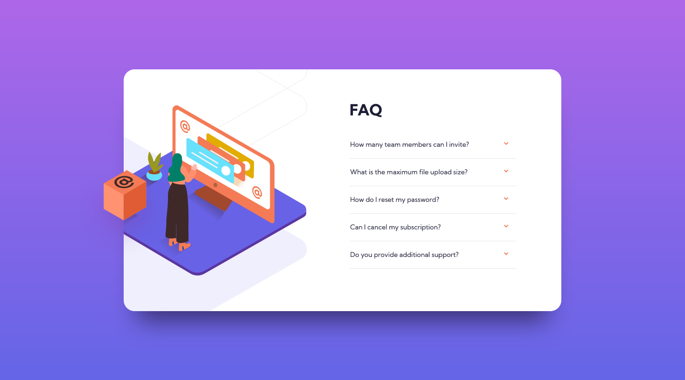

# FAQ Accordion Card

This is a solution to the [FAQ accordion card challenge on Frontend Mentor](https://www.frontendmentor.io/challenges/faq-accordion-card-XlyjD0Oam).

This project was created as part of a learning journey in web development, so the code reflects an early stage of my experience. The FAQ Accordion Card allows users to click on questions to expand and view answers. It's a simple, interactive component **built with HTML, CSS, and JavaScript**.

## Features

- **Interactive FAQ:** Clicking on a question opens the answer and collapses other open answers for a clean user experience.
- **Responsive Layout:** The design adjust to different screen sizes for an optimal display across devices.

## Screenshot and Links

| [Live Demo URL](https://ionstici.github.io/faq-accordion-card/) | [Frontend Mentor](https://www.frontendmentor.io/solutions/faq-accordion-card-6Q3xSl7P07) |
| --------------------------------------------------------------- | ---------------------------------------------------------------------------------------- |

